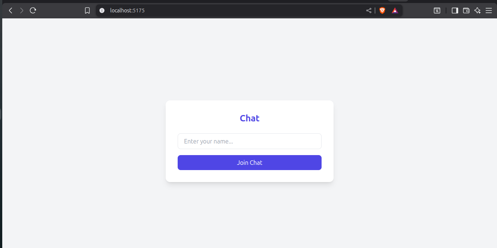
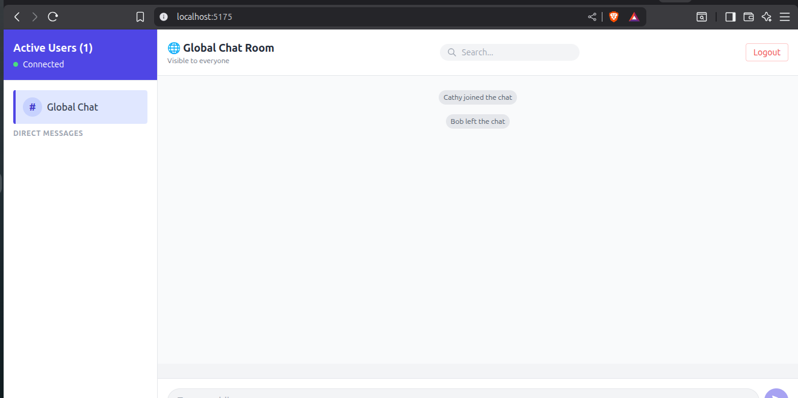
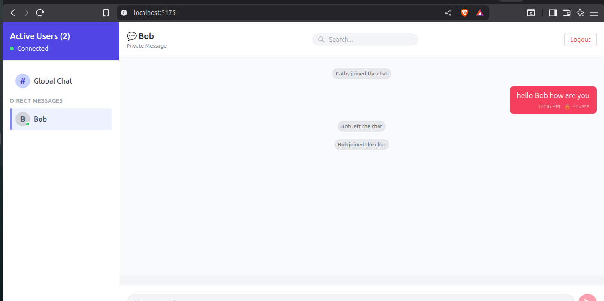

# Real-Time Chat Application with Socket.io

A modern, real-time chat application built with **React** and **Node.js** using Socket.io for bidirectional communication. This application enables users to join chat rooms, send messages instantly, see active users, and communicate via direct messages.

## Project Overview

This real-time chat application demonstrates the power of Socket.io for building interactive communication platforms. Users can join a global chat room, see who's connected, send messages in real-time, and engage in private one-on-one conversations with other users. The application features a clean, modern UI built with React and Tailwind CSS, with a responsive design that works across devices.

### Key Highlights

- 🚀 **Real-time messaging** with Socket.io WebSocket connection
- 👥 **Active user presence** tracking and display
- 💬 **Global chat room** for public conversations
- 🔒 **Private direct messaging** between users
- 🎯 **User join/leave notifications** in the chat
- 📱 **Responsive design** with Tailwind CSS
- 🎨 **Modern UI/UX** with clean interface

## Project Structure

```
real-time-communication-with-socket-io-wangarikama/
├── client/                          # React frontend application
│   ├── src/
│   │   ├── components/
│   │   │   ├── ChatWindow.jsx       # Main chat display component
│   │   │   ├── Login.jsx            # User login/join screen
│   │   │   └── Sidebar.jsx          # User list and room selection
│   │   ├── socket/
│   │   │   └── socket.js            # Socket.io client configuration
│   │   ├── App.jsx                  # Main app component
│   │   ├── main.jsx                 # React entry point
│   │   └── index.css                # Global styles
│   ├── index.html
│   ├── tailwind.config.js           # Tailwind CSS configuration
│   ├── postcss.config.js            # PostCSS configuration
│   └── package.json
├── server/                          # Node.js/Express backend
│   ├── socket/
│   │   └── socket.js                # Socket.io server configuration
│   ├── controllers/
│   │   └── chatController.js        # Chat event handlers
│   ├── models/
│   │   └── store.js                 # Data store for users and messages
│   ├── server.js                    # Express server setup
│   └── package.json
├── README.md                        
```

## Setup Instructions

### Prerequisites

- **Node.js** (v16 or higher)
- **npm** or **yarn** package manager
- A modern web browser (Chrome, Firefox, Safari, Edge)

### Installation

#### 1. Clone the Repository

```bash
git clone <repository-url>
cd real-time-communication-with-socket-io-wangarikama
```

#### 2. Install Server Dependencies

```bash
cd server
npm install
```

#### 3. Install Client Dependencies

```bash
cd ../client
npm install
```

### Running the Application

#### Terminal 1: Start the Server

```bash
cd server
npm start
```

The server will start on `http://localhost:5000` (or the port specified in your configuration).

#### Terminal 2: Start the Client

```bash
cd client
npm run dev
```

The client will start on `http://localhost:5173` (or another available port shown in the terminal).

#### 3. Open in Browser

Navigate to the URL shown in your terminal (typically `http://localhost:5173`) to access the application.

## Features Implemented

### Core Features

#### ✅ User Authentication
- **Login Screen**: Users enter their name to join the chat
- **Session Management**: User data is maintained throughout the session
- **User Presence**: Active users count displayed in real-time

#### ✅ Real-time Messaging
- **Global Chat Room**: Public channel where all users can communicate
- **Instant Message Delivery**: Messages sent and received in real-time using Socket.io
- **Message Display**: Chronological message history with user identification
- **System Messages**: Notifications when users join or leave the chat

#### ✅ Direct Messages (Private Chat)
- **User List**: All active users visible in the sidebar
- **Private Conversations**: Click on any user to open a direct message conversation
- **Separate Message Threads**: Each conversation maintains its own message history
- **One-to-One Communication**: Direct messaging between two users

#### ✅ User Interface
- **Responsive Design**: Works seamlessly on desktop and mobile devices
- **Clean Layout**: Sidebar for navigation, main chat window for messages
- **Visual Feedback**: Clear indication of who sent each message
- **Active User Highlighting**: Current room/user selection highlighted
- **Professional Styling**: Tailwind CSS for modern aesthetics

### Advanced Features

#### 🎯 Active Users Management
- Real-time user count display
- User list with online/active indicators
- Automatic user removal when they disconnect

#### 📊 Message Organization
- Separation between global chat and private messages
- Organized conversation threads
- Chronological message sorting

#### 🔄 State Management
- Efficient data handling with React hooks
- Real-time synchronization across clients
- Consistent state across the application

## Screenshots

### 1. Login Screen
Users enter their name to join the chat application.



*Initial login interface where users enter their username to access the chat.*

**Features:**
- Simple, clean login form with "Chat" heading
- User name input field with placeholder text
- "Join Chat" button to enter the application

### 2. Global Chat Room
Main chat interface showing the global chat room with active users and messages.



*Global Chat Room displaying all connected users and public messages. Shows "Active Users (1)" with "Connected" status and the Global Chat Room interface.*

**Features:**
- Active users counter showing connected users
- User list in the sidebar (showing "Connected" status)
- Global Chat Room channel selected and highlighted
- Message history displayed chronologically
- System messages showing user join/leave events

### 3. Private Messaging
Direct message interface showing one-on-one communication between users.



*Private message interface showing two active users (Cathy and Bob) with a direct message conversation. Message appears with timestamp and "Private" indicator.*

**Features:**
- User list showing all active users with profile indicators
- Direct message conversation with selected user
- Messages displayed with sender information and timestamp
- "Private" indicator on messages for direct conversations
- One-to-one communication thread maintained separately
- Real-time message delivery with timestamp (e.g., "12:56 PM")

## Technology Stack

### Frontend
- **React** - UI library for building components
- **Vite** - Lightning-fast build tool
- **Socket.io Client** - Real-time communication client
- **Tailwind CSS** - Utility-first CSS framework
- **PostCSS** - CSS transformation tool

### Backend
- **Node.js** - JavaScript runtime
- **Express** - Web framework
- **Socket.io** - WebSocket library for real-time communication
- **CORS** - Cross-origin resource sharing for client-server communication

## How It Works

### Connection Flow

1. **User joins**: User enters their name on the login screen
2. **Socket connection**: Client connects to the server via Socket.io
3. **User registered**: Server registers the new user and broadcasts to all clients
4. **UI updates**: All clients receive the updated user list
5. **Chat ready**: User can now send/receive messages in global chat or DMs

### Message Flow

1. **Message sent**: User types and sends a message
2. **Socket event**: Client emits the message via Socket.io
3. **Server processes**: Server receives and processes the message
4. **Broadcasting**: Server sends message to appropriate recipients
5. **Display**: Recipients receive and display the message in real-time

## Future Enhancements

- 📝 Message persistence with database (MongoDB/PostgreSQL)
- 🔐 User authentication with JWT tokens
- ⌨️ Typing indicators ("User is typing...")
- ✓ Message read receipts
- 🎉 Emoji support and reactions
- 📎 File/image sharing capabilities
- 🎵 Voice/video call integration
- 🌙 Dark mode toggle
- 🔍 Message search functionality
- 📱 Mobile app using React Native

## Troubleshooting

### Server won't start
- Ensure port 5000 is not in use
- Check Node.js is installed: `node --version`
- Clear node_modules and reinstall: `rm -rf node_modules && npm install`

### Client won't connect to server
- Verify server is running on the correct port
- Check CORS configuration in server.js
- Ensure Socket.io client is properly configured

### Messages not appearing
- Check browser console for errors (F12)
- Verify Socket.io connection is established
- Check server logs for any socket errors

## Resources

- [Socket.io Documentation](https://socket.io/docs/)
- [React Documentation](https://react.dev/)
- [Express.js Guide](https://expressjs.com/)
- [Tailwind CSS Docs](https://tailwindcss.com/)
- [Vite Documentation](https://vitejs.dev/)

## License

This project is part of the PLP MERN Stack Development curriculum.

## Contributing

Feel free to fork this project, make improvements, and submit pull requests.

---

**Last Updated**: November 2025  
